# Commercial area analysis project( 코로나19 확산에 따른 서울시 골목 상권의 업종별, 지역별 변화 연구)

## Abstract

1997년 외환위기 이후 국내 소상공인의 창업이 급증하면서 전체   사업체의 88%인 약 260만개 이상이 소상공인 사업체로, 이들은 우리나라의 사회, 경제적으로 중요한 역할을 한다.이러한 소상공인은 지역 주민의 일상생활과 밀접한 재화와 서비스를 제공함으로써 서민경제의 근간을 이루고 있으며, 점포 개설이 상대적으로 쉬운 도·소매업, 음식업 등의 업종을   중심으로 진입장벽이 낮은 골목상권에 주로 진입하는 양상을 보인다. 그러나 대부분의 소상공인은 규모가   영세하고, 낮은 진입장벽으로 인한 과당 경쟁 등 창업부터 사업을 지속 하기까지의 여건이 매우 열악한   상황이다또한 근래에는 COVID-19 팬데믹 사태로 인하여 상황은 더욱 악화되었다. 본 연구에서는 서울시의 골목상권을 구 별로 분류하여 분기별 매출, 시간대별 매출, 요일별 매출, 그리고 연령대별 매출을 7가지의 업종 (IT 기기, 미용, 음식업, 여가오락, 학문교육, 소매업, 그리고 의약의료)으로 구분지어 시각화 하였고, 해당 구의 연령별, 요일별, 그리고 시간대별 유동인구를 남녀 비교하여 시각화 하였다.

## Requirements

python==3.x

pandas

numpy

matplot

seaborn

## Data

본 연구에서는 골목상권의 매출 추이를 분석하기 위하여 ‘서울시 열린데이터 광장의’ ‘서울시 우리마을가게 상권분석서비스(상권배후지-추정매출)’ 자료를 활용하였다. 2013년도 1분기부터 2019년도 2분기 까지의 자료를 이용했으며, 85만여 개의 데이터를 다뤘다. 80개의 속성 중에서 ‘기준_년_코드’, ‘기준_분기_코드‘, ‘상권_코드’, ‘당월_추정_매출’을 이용하였고 ‘당월_추정_매출’ 기준으로 매출 추이를 분석하였다. 

## Results (강남구 기준)

#### 분기별 매출

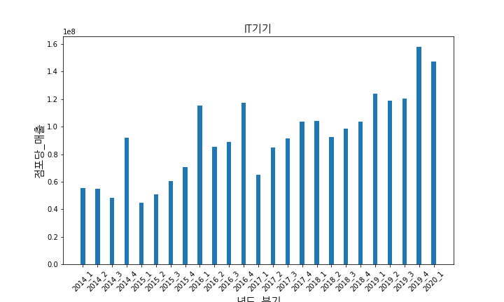

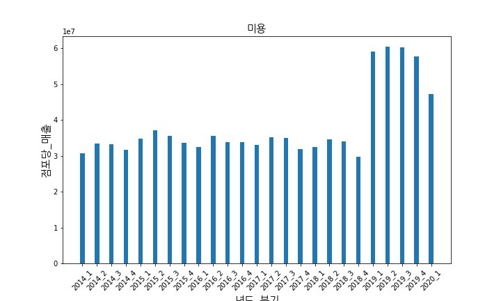

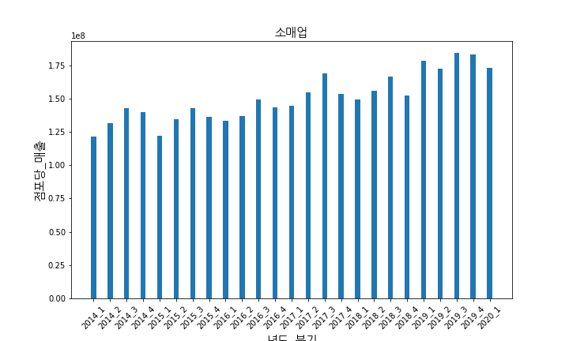

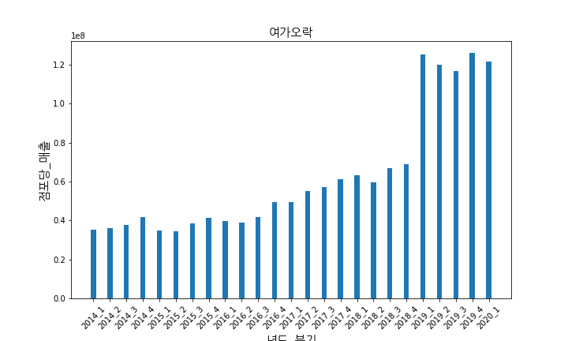

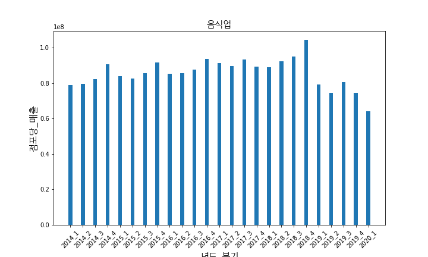

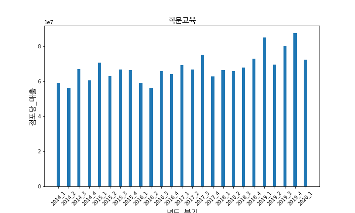

#### 시간대별 매출

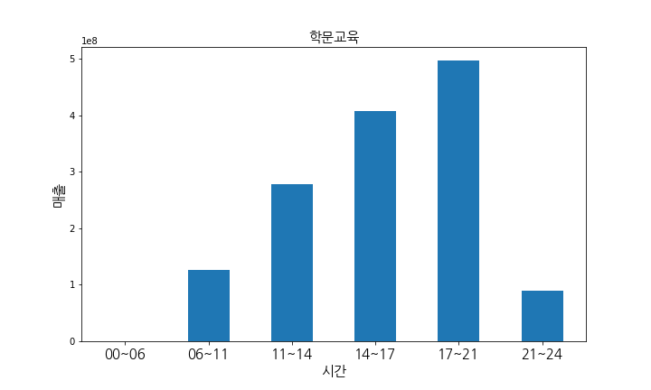

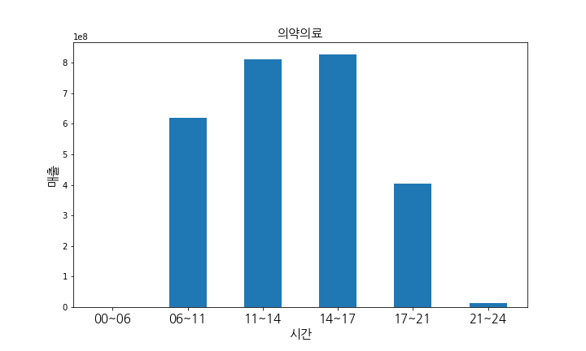

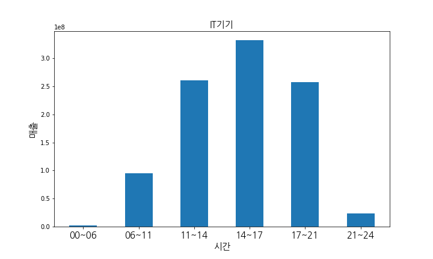

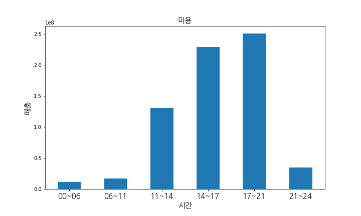

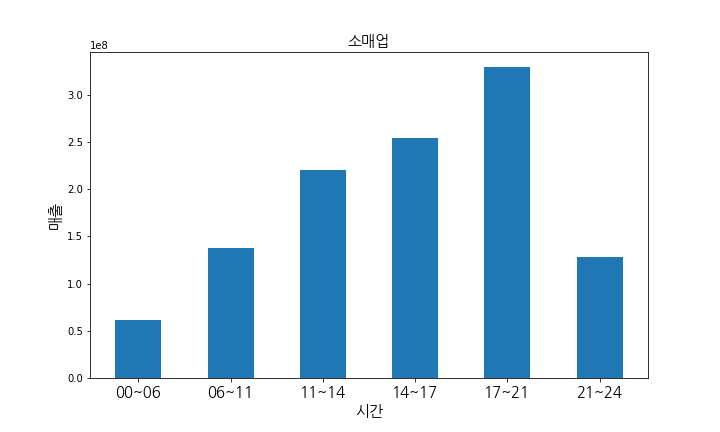

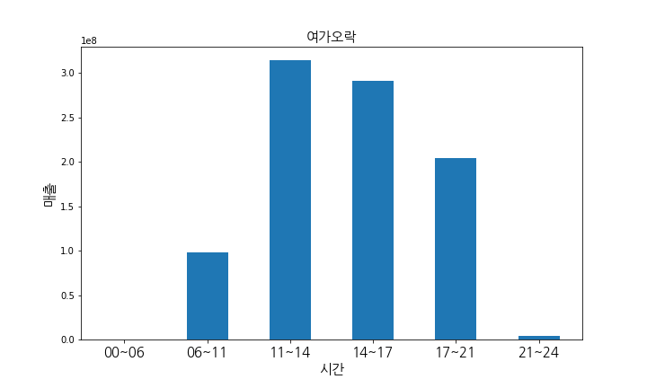

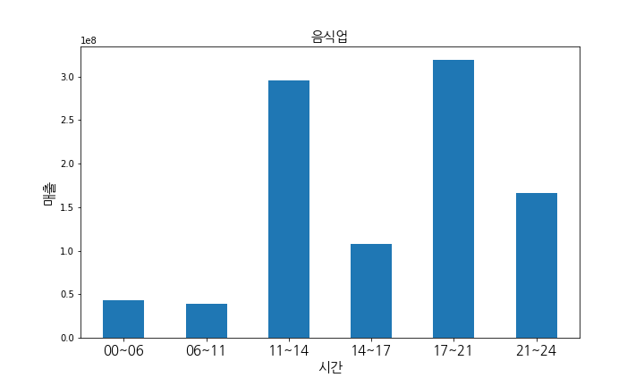

#### 연령대별

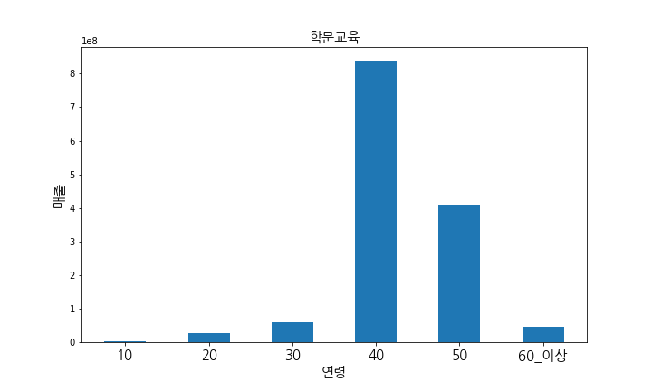

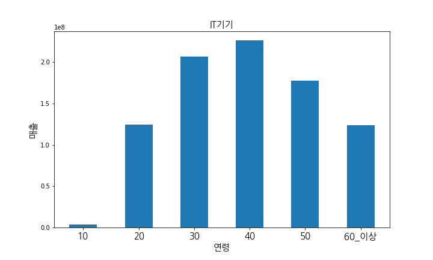

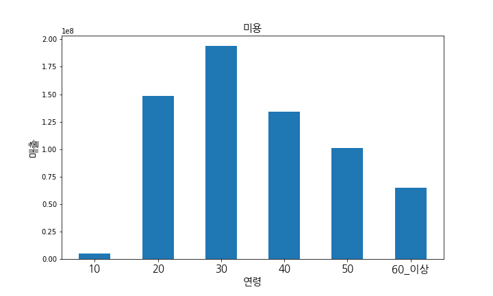

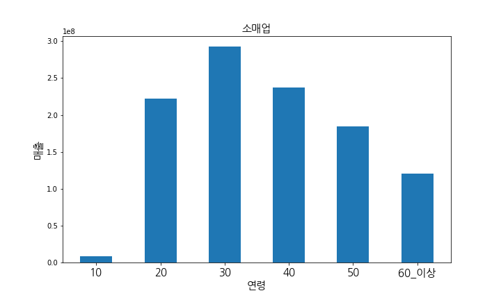

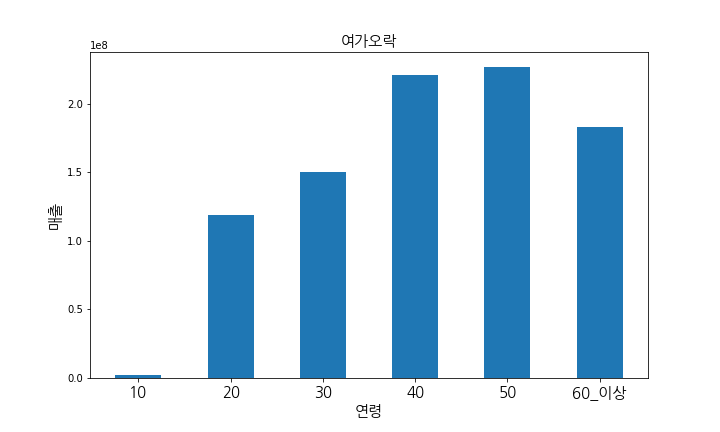

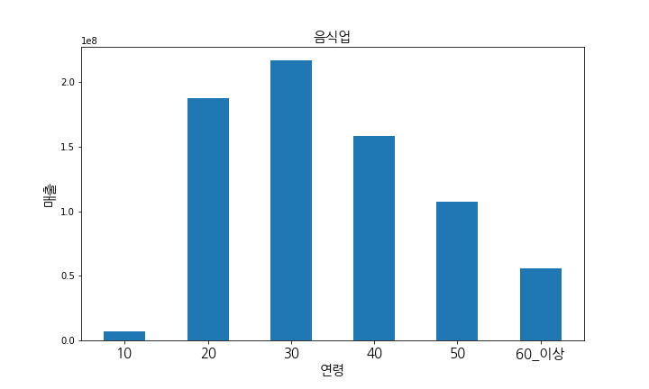

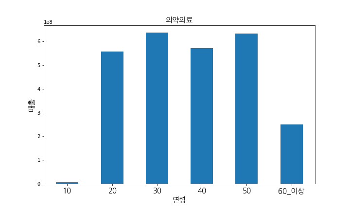

#### 요일별

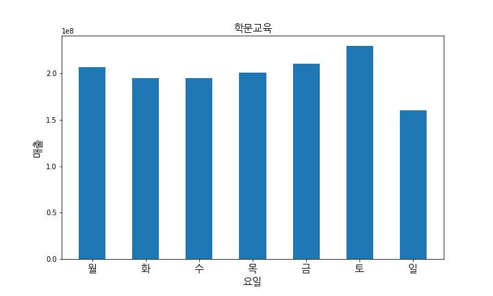

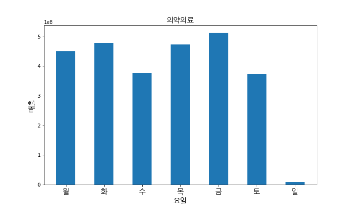

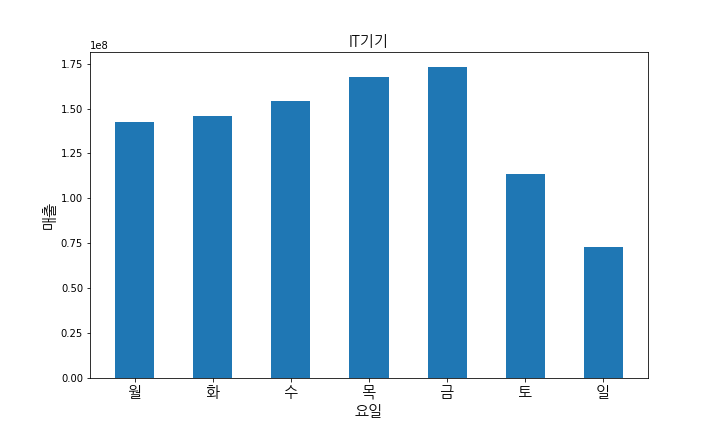

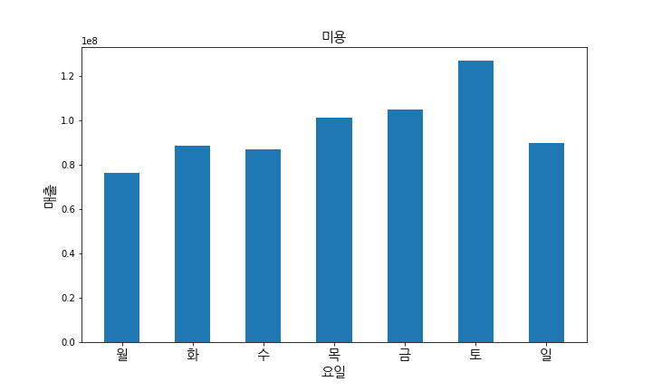

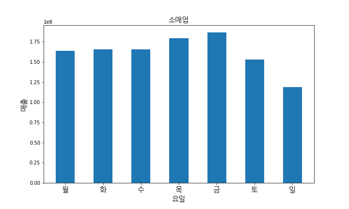

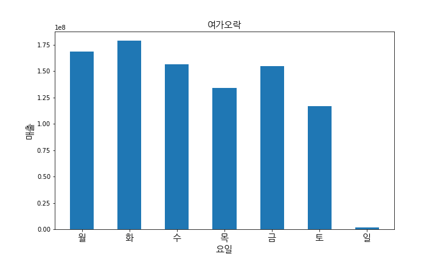

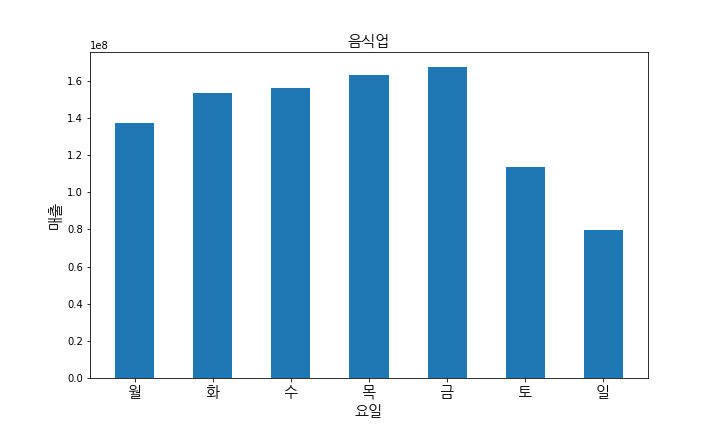

#### 유동인구

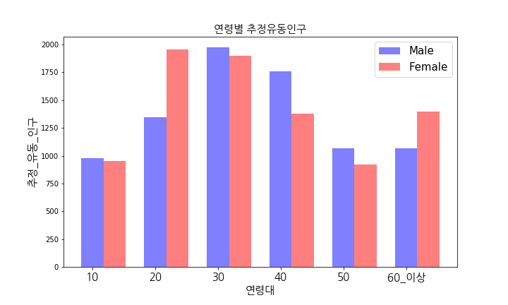

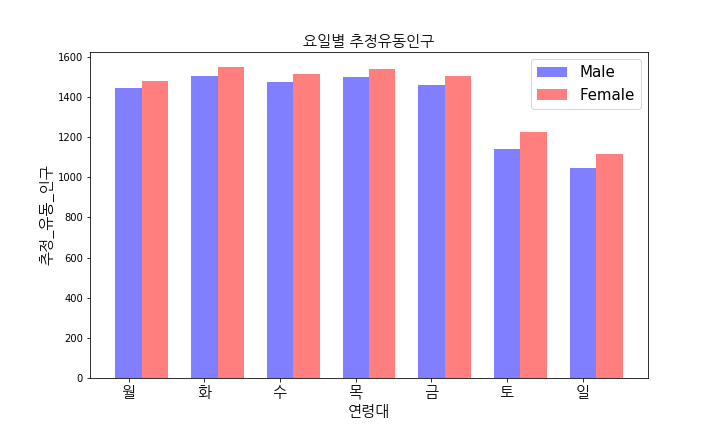

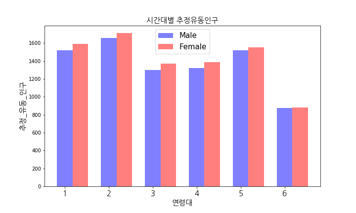